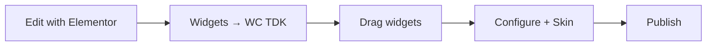

<div align="center">

# 🛒 WooCommerce Theme Developer Kit

### Ship WooCommerce storefronts faster — utilities, product skins, Elementor widgets & Gutenberg blocks built for theme developers.

<br>

[](https://github.com/Md-Abu-Bakker-Siddik/wc-theme-developer-kit/releases)
[](https://wordpress.org/)
[](https://www.php.net/)
[](https://woocommerce.com/)
[](https://www.gnu.org/licenses/gpl-2.0.html)

<br>

[Features](#-features) ·
[Quick Start](#-quick-start) ·
[Usage Guide](#-usage-guide) ·
[Installation](#-installation) ·
[Elementor](#-elementor-widgets) ·
[Gutenberg](#-gutenberg-blocks) ·
[FAQ](#-faq) ·
[Changelog](#-changelog)

<br>

</div>

---

## ✨ What is WC TDK?

**WooCommerce Theme Developer Kit** (WC TDK) gives theme authors a lightweight toolkit for common shop features — without locking you into a proprietary theme framework.

| | |
|:--|:--|
| 🎯 **Built for** | Theme developers & agencies |
| ⚡ **Core stack** | WordPress 6.0+ · PHP 7.4+ · WooCommerce |
| 🧩 **Optional** | Elementor widgets · Block Editor blocks |
| 🔒 **Privacy** | No external APIs — AJAX stays on your site |
| 📦 **HPOS** | Compatible with WooCommerce custom order tables |

---

## 🚀 Quick Start

```
Install plugin  →  Activate WooCommerce  →  (Optional) Elementor
       ↓
Set Thank You Messages  →  Add WC TDK widgets or blocks  →  Pick a Skin  →  Publish
```

| Step | Action |
|:--:|:-------|
| **1** | Upload & activate **WooCommerce Theme Developer Kit** |
| **2** | Ensure **[WooCommerce](https://wordpress.org/plugins/woocommerce/)** is active |
| **3** | Go to **WooCommerce → Settings → Thank You Messages** *(optional)* |
| **4** | Add **WC TDK** widgets (Elementor) or blocks (Gutenberg) to your pages |
| **5** | Choose **Skin 1** or **Skin 2** on product grids → **Publish** |

---

## 🎁 Features

### Core — works with WooCommerce only

| | Feature | What it does |
|:---:|:--------|:-------------|
| 💬 | **Thank you messages** | Custom text per payment gateway |
| 🛍️ | **AJAX side cart** | Slide-in cart panel |
| 🏷️ | **Sale badges** | Percentage off on product loops |
| 👁️ | **Quick view** | AJAX product modal (nonce secured) |
| ⚡ | **Buy now** | Skip cart → checkout (nonce secured) |
| 📋 | **Checkout fields** | Streamlined fields + alt. phone |
| 🖼️ | **Theme helpers** | WC gallery zoom, lightbox, slider |

### Automatic — no extra settings

> These run as soon as the plugin is active — no configuration needed.

| | Runs on |
|:---:|:--------|
| 🏷️ | Shop & archive loops — **sale %** badges |
| ⚡ | Single product — **Buy now** button |
| 👁️ | WC Products cards — **Quick view** |
| 📋 | Checkout — optimized fields |
| 🛍️ | All pages — **side cart** markup |

### Product skins

Pair with the **WC Products** widget or block:

| Skin | Name | Best for |
|:----:|:-----|:---------|
| **1** | Modern Card | Card layout, hover actions, Quick View |
| **2** | Classic Shop | Traditional shop grid look |

---

## 📖 Usage Guide

### Thank you messages

Customize the order-received text **per payment method**.

1. Open **WooCommerce → Settings**
2. Select the **Thank You Messages** tab
3. Enter a message for each **enabled** gateway (COD, Stripe, etc.)
4. Click **Save changes**

> Enable gateways first under **WooCommerce → Settings → Payments** if the tab shows no fields.

---

### Elementor workflow



#### Recommended header layout

```
┌──────────────────────────────────────────────────────────────┐
│  Logo     Header Search          Account · Wishlist · Cart   │
└──────────────────────────────────────────────────────────────┘
```

| Widget | Use case |
|--------|----------|
| **Header Search** | Product search (icon or full form) |
| **Header Cart** | Mini cart, count, dropdown or side panel |
| **Account** | Login / My Account links |
| **Wishlist** | Wishlist icon in header |
| **Vertical Menu** | Category navigation |

#### WC Products widget

Open **Widgets → WC TDK → WC (WooCommerce) Products**

| Setting | Options |
|---------|---------|
| **Display Type** | Grid · Masonry · Carousel |
| **Product Type** | Recent · Featured · Sale · Best selling · *(Pro: by ID)* |
| **Columns** | 1–6 |
| **Skin** *(widget tab)* | Skin 1 — Modern Card · Skin 2 — Classic Shop |

**Header Cart → Dropdown Content Style**

| Style | Behavior |
|-------|----------|
| Dropdown | Mini cart drops below icon |
| No Dropdown | Icon + count only |
| Side Panel | Opens side panel *(theme wrapper recommended)* |

---

### Gutenberg workflow

1. Edit any page or post
2. Click **+** → search `WooCommerce Theme Developer Kit`
3. Pick a block from category **WooCommerce Theme Developer Kit**
4. Configure in the **right sidebar** (Layout, Skin, limits, etc.)
5. **Update** / **Publish**

#### Available blocks

| Block | Slug | Highlights |
|-------|------|------------|
| WC Products | `wc-tdk/wc-products` | Grid · Carousel · Masonry · 2 skins |
| Product Category | `wc-tdk/product-category` | Category grid |
| Product List | `wc-tdk/product-list` | Curated lists |
| Product Tabs | `wc-tdk/product-tabs` | Tabbed sections |
| Info Banner | `wc-tdk/info-banner` | Promo / hero banners |
| Header Cart | `wc-tdk/header-cart` | Dropdown · Side cart layout |
| Header Search | `wc-tdk/header-search` | Header product search |
| Account | `wc-tdk/account` | Account links |
| Wishlist | `wc-tdk/wishlist` | Wishlist UI |
| Vertical Menu | `wc-tdk/vertical-menu` | Category menu |

---

### AJAX side cart

The global side cart (`#wc-tdk-side-cart`) loads on every front-end page.

A default **Cart** toggle button is added (`#wc-tdk-cart-toggle`). To use your own icon:

```css
#wc-tdk-cart-toggle {
  display: none !important;
}
```

```javascript
jQuery('#my-cart-button').on('click', function (e) {
  e.preventDefault();
  jQuery('#wc-tdk-side-cart').addClass('active').show();
});
```

---

### Theme developer hooks

```php
// Quick View button in custom templates
if ( function_exists( 'wc_tdk_quickview_button' ) ) {
    wc_tdk_quickview_button();
}

// Quick View + related actions
if ( function_exists( 'wc_tdk_render_product_action_buttons' ) ) {
    wc_tdk_render_product_action_buttons();
}
```

| Item | Value |
|------|-------|
| Text domain | `wc-tdk` |
| Translations | `/languages/` |
| Uninstall | Removes `wc_tdk_*` options from the database |

---

## 📥 Installation

<details open>
<summary><strong>WordPress admin (recommended)</strong></summary>

1. **Plugins → Add New → Upload Plugin**
2. Choose the plugin ZIP and click **Install Now**
3. Click **Activate**
4. Install & activate **[WooCommerce](https://wordpress.org/plugins/woocommerce/)**
5. *(Optional)* Install **[Elementor](https://wordpress.org/plugins/elementor/)**

</details>

<details>
<summary><strong>Manual / FTP</strong></summary>

Copy the folder to:

```
wp-content/plugins/wc-theme-developer-kit/
```

Then activate from **Plugins** in wp-admin.

</details>

<details>
<summary><strong>Git clone (development)</strong></summary>

```bash
git clone https://github.com/Md-Abu-Bakker-Siddik/wc-theme-developer-kit.git
cd wc-theme-developer-kit
```

</details>

---

## 🧩 Elementor widgets

> Requires [Elementor](https://wordpress.org/plugins/elementor/). Widgets appear under category **WC TDK**.

| Widget | Description |
|--------|-------------|
| **WC Products** | Grids, masonry, carousel, filters, 2 skins |
| **Product Category** | Category grids — 5 skins |
| **Product List** | Curated product lists |
| **Product Tabs** | Tabbed product sections |
| **Info Banner** | Hero / promo banners (multiple layouts) |
| **Header Cart** | Mini cart with style options |
| **Header Search** | Product search for headers |
| **Account** | My Account navigation |
| **Wishlist** | Wishlist icon / UI |
| **Vertical Menu** | Vertical category menu |

Elementor is **not required** — core features and Gutenberg blocks work without it.

---

## 🧱 Gutenberg blocks

Server-rendered blocks in category **WooCommerce Theme Developer Kit**:

```
wc-tdk/wc-products          wc-tdk/product-category      wc-tdk/product-list
wc-tdk/product-tabs         wc-tdk/info-banner           wc-tdk/header-cart
wc-tdk/header-search        wc-tdk/account               wc-tdk/wishlist
wc-tdk/vertical-menu
```

Skins and layouts align with the Elementor **WC Products** widget where applicable.

---

## ❓ FAQ

<details>
<summary><strong>Do I need Elementor?</strong></summary>

No. Core WooCommerce features and all Gutenberg blocks work without Elementor. Widgets load only when Elementor is active.
</details>

<details>
<summary><strong>Does this support HPOS (custom order tables)?</strong></summary>

Yes. The plugin declares compatibility with WooCommerce custom order tables and cart/checkout blocks.
</details>

<details>
<summary><strong>Are external services used?</strong></summary>

No. AJAX (e.g. Quick View) uses your site only — `admin-ajax.php`.
</details>

<details>
<summary><strong>What data is stored?</strong></summary>

| Data | Location |
|------|----------|
| Thank you messages | `wp_options` (`wc_tdk_*`) |
| Alternative phone | Order meta `_billing_alternative_phone` |
| On uninstall | All `wc_tdk_*` options removed |

</details>

<details>
<summary><strong>Troubleshooting</strong></summary>

| Issue | Fix |
|-------|-----|
| Widgets missing | Activate Elementor; look for **WC TDK** category |
| No products shown | Confirm WooCommerce is active and products exist |
| Quick View fails | Clear cache; check browser console; ensure jQuery loads |
| No sale % badge | Set regular + sale price on the product |
| Product IDs in Elementor | Requires **Elementor Pro** |

</details>

---

## 📋 Changelog

<details>
<summary><strong>v1.0.8</strong> — current</summary>

See [readme.txt](readme.txt) and the plugin header for full release notes.
</details>

<details>
<summary><strong>v1.0.6</strong></summary>

- Fixed Gutenberg WC Products block (`$settings` undefined, editor grid CSS)
- Quick View AJAX 500 fix; improved hover button on product cards
- Normalized template params for widgets and blocks
</details>

<details>
<summary><strong>v1.0.5 – v1.0.0</strong></summary>

| Version | Highlights |
|---------|------------|
| **1.0.5** | Quick View button layout fix on Skin 1 |
| **1.0.4** | WPCS security, HPOS, uninstall routine, Buy Now / Quick View nonces |
| **1.0.0** | Initial release |

</details>

Full history → [readme.txt](readme.txt)

---

## 🛠️ Development

```bash
phpcs --standard=phpcs.xml.dist .
```

```
wc-theme-developer-kit/
├── includes/                 # PHP classes, widgets, blocks
│   ├── widgets/              # Elementor widgets
│   └── blocks/               # Gutenberg block classes
├── assets/                   # CSS, JS, block editor
├── languages/                # i18n (text domain: wc-tdk)
├── readme.txt                # WordPress.org readme
└── wc-theme-developer-kit.php
```

---

<div align="center">

### Made for WooCommerce theme developers

**[Md Abu Bakker Siddik](https://profiles.wordpress.org/mdabubakkersiddik/)**

[](https://github.com/Md-Abu-Bakker-Siddik)
[](https://profiles.wordpress.org/mdabubakkersiddik/)

<br>

Licensed under [GPL-2.0-or-later](https://www.gnu.org/licenses/gpl-2.0.html)

</div>
